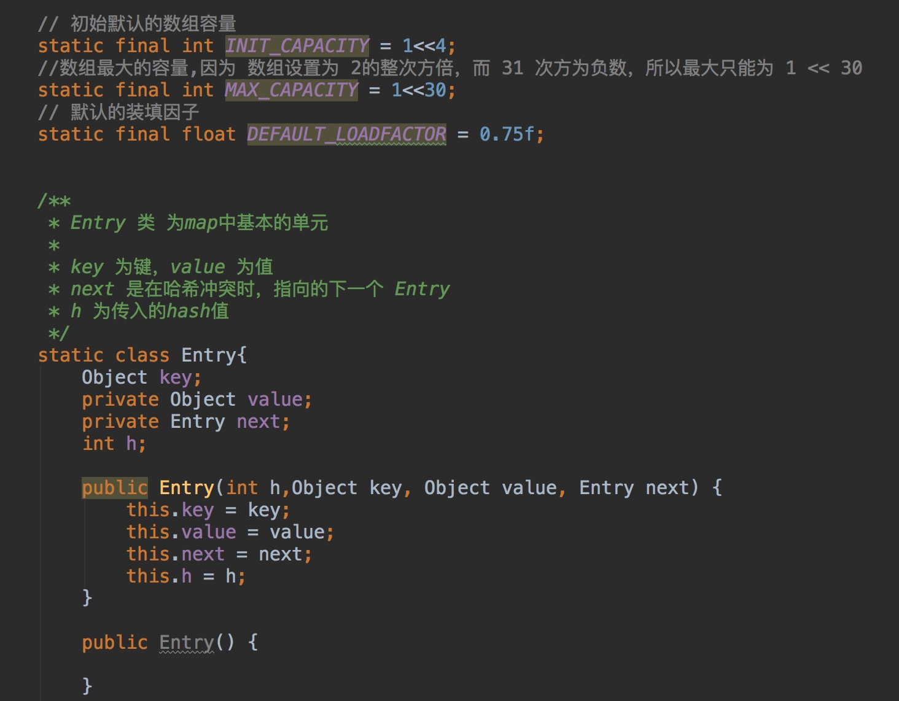
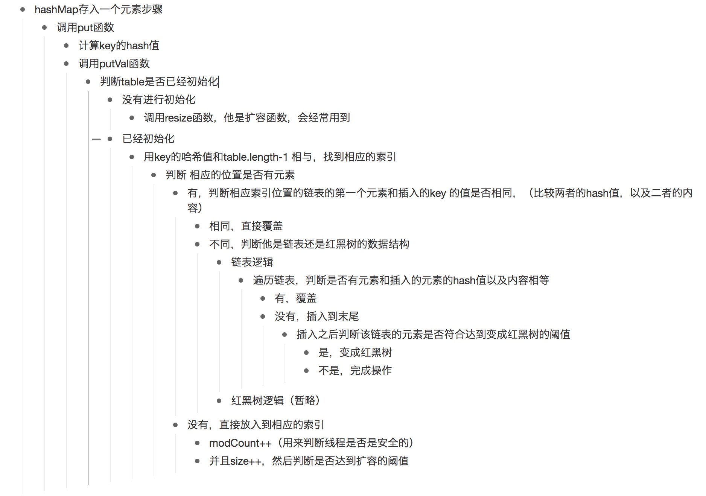

# wangei

> HashMap 数据结构非常重要，经常被用来面试。因为它综合了数组以及链表的知识，还有非常重要的hash算法，在以后的工作中也经常被用到，其中还有很多非常高效的算法。但是hashMap对于很多人来说比较困难，可能会用，但是并不清楚怎么实现，或者不清楚他的执行逻辑。
>
> 我就通过语句的执行以及函数的调用顺序来
>
> 注释应该非常非常细了，因为我基本判断语句以及一些不清楚的变量逻辑都进行了中文注释

- 采用 JDK 8 的源码进行分析
- 本人技术有限，红黑树部分并没有进行分析，不过对于理解 HashMap 的存取过程影响不太大
- 对于泛型K，V使用 Object代替，其他的关键字比如final,transient并没有写。因为这不是重点
- 为了你们方便，我在截图的时候截取了源码的行号，你们可以自行去查看源码对应的位置
- 数据类型，1.8应该使用的是 `Node` 命名，但是我使用的是 `Entry`，不过逻辑还是1.8的逻辑


## 本文结构脉络


## 个人理解语句以及中文注释

 存放在我的 github 上：

[https://github.com/leosanqing/StructAndAlgorithm/tree/master/Struct/hashMapDemo](https://github.com/leosanqing/StructAndAlgorithm/tree/master/Struct/hashMapDemo)

类似于这种格式




# HashMap 的数据结构

## 数组+链表

### 为啥采用这种方式

**当然是为了快，为了效率**

数组在知道下标之后查询速度尤其快，O(1)的时间复杂度

链表在增删的时候速度非常快，**找到位置后**（前提），处理只需要O(1)的时间复杂度，因为不需要移动数据的位置，只需要更改指向的地址即可。但是链表在遍历对比的时候非常慢，时间复杂度为O(n)，所以用来做 **哈希冲突**时的解决方法

> 所以查询一个数据的时间复杂度为 O(1)+O(n)。不过因为哈希算法的非常巧妙，会让冲突尽可能地均匀分布，所以链一般极其短。所以后面遍历链表的时间可以忽略不计，而且在 JDK8 之后，如果冲突的链表长度大于 8，那么就会转化为 红黑树，他的遍历的时间复杂度为O(log n)

## 源码中的变量名

### 数组

数组的话，源码中使用的是 `table` 命名，你也可以称之为 **桶**

```java
Node[] table;
```

### 链表

链表的话，JDK 1.7中使用的是 `Entry`,JDK1.8采用的是 `Node`命名。基本一样，只是名字不同,结构定义如下.

（我是按照1.7的命名， 不过其他逻辑是1.8的）

```java
/**
     * Entry 类 为map中基本的单元
     *
     * key 为键，value 为值
     * next 是在哈希冲突时，指向的下一个 Entry
     * h 为传入的hash值,源码中为 hash
     */
static class Entry{
        Object key;
        Object value;
        Entry next;
        int h;
}
```

### 其他

```java
// 初始默认的数组容量
static final int INIT_CAPACITY = 1<<4;
//数组最大的容量,因为 数组设置为 2的整次方倍，而 32 次方为负数，所以最大只能为 1 << 30，即2的31次方
static final int MAX_CAPACITY = 1<<30;
// 默认的装填因子
static final float DEFAULT_LOADFACTOR = 0.75f;

// table 桶中的个数--数组的大小;
int size;

// 修改次数
int modCount;

// 扩容的阈值, capacity * load factor
int threshold;

// 装填因子
float loadFactor;
```


#  put元素

>  如果你看懂了这个过程，那么基本上 HashMap 的主要逻辑就算是基本理解了

## 步骤

1. 判断 key 是否为空，如果为空直接放到 `table[0]`的位置，如果不为空，经过运算确定其在`table`中的下标
2. 然后再判断相应的索引上是否已经有元素了，没有的话，直接修改；有的话再判断`key`值是否相等，相等的话，直接覆盖`value`,不相等的话遍历链表(红黑树)，并插入到链表最后
3. 在第二步的插入时，先判断 ++size是否已经大于了阈值，大于需要扩容。

稍微详细些的步骤看下方思维导图，同样缩进的为 if-else 关系

、

> 还有的细节没有写，待会儿跟着源码再细讲，我就跟着源码的调用顺序分析


## 那么假如我现在执行下面的语句，他到底怎么执行

```java
import java.util.HashMap;

public class Test {
    public static void main(String[] args) {
        HashMap hashMap = new HashMap();
        hashMap.put("name","zhangSan");
        
    }
}
```


### 第一条语句-构造函数

```java
public MyHashMap(int initCapacity,float loadFactor) {
        if(initCapacity<0)
            throw new IllegalArgumentException("初始化容量失败: "+
                                                    initCapacity);
        if(initCapacity>= MAX_CAPACITY)
            initCapacity= MAX_CAPACITY;
        if(loadFactor<=0||Float.isNaN(loadFactor))
            throw new IllegalArgumentException("装填因子不合法"+
                                                    loadFactor);
        this.loadFactor=loadFactor;
        this.threshold=tableSizeFor(initCapacity);

    }
public MyHashMap(int initCapacity) {
    this(initCapacity,DEFAULT_LOADFACTOR);
}

/**
 * 无参的，全部默认
 */
public MyHashMap() {
    this.loadFactor=DEFAULT_LOADFACTOR;
}


public MyHashMap(Map m){
    this.loadFactor=DEFAULT_LOADFACTOR;

}
```

如果没有传入参数，他就会调用无参的构造器，那么默认的长度为 16,`DEFAULT_INITIAL_CAPACITY`,默认的装填因子为 0.75，`DEFAULT_LOAD_FACTOR`,传入范围(0,1];

**注意：这个时候，数组还没有初始化，仅仅是定义了一个Entry类型的数组**

### 第二条语句

执行`hashMap.put("name","zhangSan")`

#### put函数

首先他在源码中是这样的，他又调用了`putVal`函数，专门存入元素的函数(ps:源码 611行)

```java
public V put(K key, V value) {
    return putVal(hash(key), key, value, false, true);
}
```

他传入了5个值，但是我们先重点关注前三个值，第一个是要存入的key的`hash`值，第二个是key，第三个是value，至于K,V泛型如果不了解，你可以理解为 Object类型，如果按照测试的语句，你就可以把它当成 `String`类型。

这个put函数，他有返回值，返回值是null，或者oldValue，看了下面的`putValue`函数你就知道了

#### hash 函数，计算哈希值

> 传入这个参数是为了创建节点node以及计算索引时用

源码(第337 行)

```java
static final int hash(Object key) {
    int h;
  	// 将key 的高16位和低16位进行异或
    return (key == null) ? 0 : (h = key.hashCode()) ^ (h >>> 16);
}
```

> 这个也是 JDK 1.8的改进，1.7不是这样的。

##### 改进的目的

主要是从速度、功效、质量来考虑的，这么做可以在数组table的n比较小的时候，也能保证考虑到高低bit都参与到hash的计算中（为了是分布更均匀），同时不会有太大的开销。


#### putValue函数

```java
private Object putVal(int hash, Object key, Object value, boolean onlyIfAbsent, boolean evict) {
        Entry[] tab;
        Entry p;
    int n,i;
    // 如果第一次 进行存放数据，进行初始化，table 被延迟到进行数据存放时才初始化
    if((tab = table) == null || (n = table.length)==0){
        n = (tab = resize()).length;
    }
    if((p = table[i = ((n - 1) & hash)]) == null){
        tab[i] = newEntry(hash,key,value,null);
    }

    else {
        Entry e;
        Object k;
        // 如果 key 相同，那么就直接将 value 覆盖
        // 为什么要比较这么多次

        // 1.首先判断 哈希值是否相同
        if(p.h == hash &&
                // 2.判断两个key是否相等，使用 '==' 是非字符串情况，之比较两个的内容，使用'equals' 是针对字符串
                (((k = p.key) == key) || (key != null && key.equals(k))))
            // 覆盖value值
            e = p;

        // 这个是树的情况
        //else if(p instance of TreeNode)

        // 链
        else{
            for(int binCount=0;;++binCount){
                // 遍历到最后，插入
                if((e = p.next) == null){
                    p.next = newEntry(hash,key,value,null);

                    /*
                      如果 binCount >=转化树的阈值-1 ,则将链表转化为树

                    if(binCount >= TREEIFY_THRESHOLD-1)
                        treeifyBin(tab,hash);

                    */
                    break;
                }
                if(p.h == hash &&
                        (((k = p.key) == key) || (key != null && key.equals(k))))
                    break;
                // 移动到下一个
                p = e;
            }


            // 如果有相应的映射，即key相同
            if(e != null){
                 Object oldValue = e.value;
                 if(!onlyIfAbsent || oldValue == null)
                     e.value = value;
                 return oldValue;
            }

        }

    }
    // 修改次数 ++
    ++ modCount;

    // 大于阈值就扩容
    if(++size >threshold)
        resize();
  
    //afterNodeInsertion(evict);

    return null;

}
```

##### 返回值

看了上面的源码分析你就能解决上面的疑问，put函数有返回值，返回值为`null`或者`oldValue`。

**先记住答案：当他不产生覆盖的时候，返回null；当他产生覆盖的时候返回 oldVal，即原来被覆盖的值**

我们先进行测试，你就大概知道意思了

```java
import java.util.HashMap;

public class Test {
    public static void main(String[] args) {
        HashMap hashMap = new HashMap();
        hashMap.put("name","张三");

        Object oldValue1 = hashMap.put("name","李四");
        Object oldValue2 = hashMap.put("age",18);
        System.out.println("oldValue = " + oldValue1);
        System.out.println("oldValue2 = " + oldValue2);
    }
}
```


> 我想现在你应该清楚了，当输入的key的内容相同，hash值也相同的时候，他就会覆盖之前的Value值，并且返回被覆盖前的value值。(假设输入的只是String类型，如果是自定义的对象，需要重写 hashCode 和 equals 方法)


这个的关键代码在上面函数的`++modCount`一行上面，我有注释

```java 
// 如果有相应的映射，即key相同
if(e != null){
    Object oldValue = e.value;
    if(!onlyIfAbsent || oldValue == null)
      e.value = value;
    return oldValue;
}
```


##### 分析putValue函数

###### 条件

首先要判断table数组是否初始化了，即这条语句`if ((tab = table) == null || (n = tab.length) == 0)`，

- 如果没有初始化则要调用`resize`方法(后面分析).**可以直接看索引为 `resize函数`的内容**
- **如果已经初始化了，就需要计算元素的索引了(这个是非常重要的一步，也是他为啥能在O(1)的时间复杂度内找到在数组中的相应位置)**

###### 计算索引

将 key 的 hash 值和`table.length-1 `相与，相与的结果就是要存入的元素的table中的 位置`tab[(n - 1) & hash]`。

这个时候看源码，它分为两种情况：

第一种：相应的索引上没有元素(只有这个时候 size才++，相应索引上有元素，size是不会 ++ 的)

```java
// 如果table 数组的相应的索引上没有元素，那么直接创建一个新的节点
if ((p = tab[i = (n - 1) & hash]) == null)
    tab[i] = newNode(hash, key, value, null);
// 修改次数++
++modCount;
// 判断是否需要扩容
if (++size > threshold)
  resize();
afterNodeInsertion(evict);
return null;
```

> 现在知道啥时候返回 null了吧


第二种：相应的索引上有元素

> 这个时候就要判断元素的key是否相等`if(p.h == hash &&(((k = p.key) == key) || (key != null && key.equals(k))))`

```java
else {
    Entry e;
    Object k;
    // 如果 key 相同，那么就直接将 value 覆盖
    // 为什么要比较这么多次

    // 1.首先判断 哈希值是否相同
    if(p.h == hash &&
            // 2.判断两个key是否相等，使用 '==' 是非字符串情况，之比较两个的内容，使用'equals' 是针对字符串
            (((k = p.key) == key) || (key != null && key.equals(k))))
        // 覆盖value值
        e = p;

    // 这个是树的情况
    //else if(p instance of TreeNode)

    // 链
    else{
        for(int binCount=0;;++binCount){
            // 遍历到最后，插入
            if((e = p.next) == null){
                p.next = newEntry(hash,key,value,null);

                /*
                  如果 binCount > 转化树的阈值 ,则将链表转化为树

                if(binCount >= TREEIFY_THRESHOLD-1)
                    treeifyBin(tab,hash);

                */
                break;
            }
            if(p.h == hash &&
                    (((k = p.key) == key) || (key != null && key.equals(k))))
                break;
            // 移动到下一个
            p = e;
        }


        // 如果有相应的映射，即
        if(e != null){
             Object oldValue = e.value;
             if(!onlyIfAbsent || oldValue == null)
                 e.value = value;
             return oldValue;
        }
    }
}
```


> 这就是返回 oldValue的情况，当然上面的也有情况并不会返回oldValue


#### resize函数

这个是进行扩容的函数，也是非常重要的，要确保每次扩容前后容量大小都是`2的n次方`。并且在JDK 1.8中，对这个函数进行了优化，使得算法非常的高效

##### 调用的情景

1. 初始化 数组table。在putVal函数中，(源码第628行)

   ```java
   if ((tab = table) == null || (n = tab.length) == 0)
       n = (tab = resize()).length;
   ```

2. 进行扩容数组table的size达到阈值时，即++size > load factor * capacity 时，也是在`putVal`函数中

   ```java
   if (++size > threshold)
       resize();
   ```


##### 执行逻辑


##### 源码注释

> 忽略了树的逻辑，只有相应的条件

```java
final  Entry[] resize() {
    // 定义旧的数组为 Entry 类型的数组，oldTab
    Entry[] oldTab = table;
    // 如果oldTab==null  则返回 0，否则返回数组大小
    int oldCap = (oldTab==null) ? 0 : oldTab.length;

    int oldThreshold = threshold;

    int newCap=0,newThreshold=0;

    // 说明已经不是第一次 扩容，那么已经初始化过，容量一定是 2的n次方，所以可以直接位运算
    if(oldCap>0){
        // 如果 原来的数组大小已经大于等于了最大值，那么阈值设置为 Integer的最大值,即不会再进行扩容
        if(oldCap >= MAX_CAPACITY){
            threshold = Integer.MAX_VALUE;
            return oldTab;
        }

        // 因此已经不是第一次扩容，一定是2的n次方
        else if ((newCap = oldCap << 1) < MAX_CAPACITY &&
                  oldCap >= INIT_CAPACITY)

            newThreshold = oldThreshold << 1;

    }
    // 如果oldThreshold > 0,并且oldCap == 0，说明是还没有进行调用resize方法。
    // 说明输入了初始值，且oldThreshold为 比输入值大的最小的2的n次方
    // 那么就把 oldThreshold 的值赋给 newCap ，因为这个值现在为 比输入值大的最小的2的n次方
    else if(oldThreshold>0)
        newCap = oldThreshold;

    // 满足这个条件只有调用无参构造函数，注意只有；
    else{
        newCap = INIT_CAPACITY;
        newThreshold = (int) (INIT_CAPACITY * DEFAULT_LOADFACTOR);
    }

    if(newThreshold == 0){

        float ft = (float) (newCap * loadFactor);
        newThreshold =(newCap < MAX_CAPACITY && ft < (float) MAX_CAPACITY ?
                (int )ft : Integer.MAX_VALUE);
    }

    threshold = newThreshold;

    Entry newTable[] = new Entry[newCap];
    table=newTable;

    // 将原来数组中的所有元素都 copy进新的数组
    if(oldTab != null){
        for (int j = 0; j < oldCap; j++) {
            Entry e;

            if((e = oldTab[j]) != null){
                oldTab[j] = null;

                // 说明还没有成链，数组上只有一个
                if(e.next == null){
                    // 重新计算 数组索引 值
                    newTable[e.h & (newCap-1)] = e;

                }
                // 判断是否为树结构
                //else if (e instanceof TreeNode)


                // 如果不是树，只是链表,即长度还没有大于 8 进化成树
                else{
                    // 扩容后，如果元素的 index 还是原来的。就使用这个lo前缀的
                    Entry loHead=null, loTail =null;

                    // 扩容后  元素index改变，那么就使用 hi前缀开头的
                    Entry hiHead = null, hiTail = null;
                    Entry next;
                    do {
                        next = e.next;
                        if((e.h & oldCap) == 0){
                            // 如果 loTail == null ,说明这个 位置上是第一次添加，没有哈希冲突
                            if(loTail == null)
                                loHead = e;
                            else
                                loTail.next = e;
                            loTail = e;
                        }
                        else{
                            if(hiTail == null)
                                loHead = e;
                            else
                                hiTail.next = e;
                            hiTail = e ;
                        }

                    }while ((e = next) != null);


                    if(loTail != null){
                        loTail.next = null;
                        newTable[j] = loHead;
                    }

                    // 新的index 等于原来的 index+oldCap
                    else {

                        hiTail.next = null;
                        newTable[j+oldCap] = hiHead;
                    }

                }
            }

        }
    }

    return newTable;
}
```


##### 重要：扩容后元素的位置

```java
// 将原来数组中的所有元素都 copy进新的数组
if(oldTab != null){
    for (int j = 0; j < oldCap; j++) {
        Entry e;

        if((e = oldTab[j]) != null){
            oldTab[j] = null;

            // 说明还没有成链，数组上只有一个
            if(e.next == null){
                // 重新计算 数组索引 值
                newTable[e.h & (newCap-1)] = e;

            }
            // 判断是否为树结构
            //else if (e instanceof TreeNode)


            // 如果不是树，只是链表,即长度还没有大于 8 进化成树
            else{
                // 扩容后，如果元素的 index 还是原来的。就使用这个lo前缀的
                Entry loHead=null, loTail =null;

                // 扩容后  元素index改变，那么就使用 hi前缀开头的
                Entry hiHead = null, hiTail = null;
                Entry next;
                do {
                    next = e.next;
                  	//这个非常重要，也比较难懂，将它和原来的长度进行相与，就是判断他的原来的hash的上一个												bit 位是否为 1.下面我再详细说
                    if((e.h & oldCap) == 0){
                        // 如果 loTail == null ,说明这个 位置上是第一次添加，没有哈希冲突
                        if(loTail == null)
                            loHead = e;
                        else
                            loTail.next = e;
                        loTail = e;
                    }
                    else{
                        if(hiTail == null)
                            loHead = e;
                        else
                            hiTail.next = e;
                        hiTail = e ;
                    }

                }while ((e = next) != null);


                if(loTail != null){
                    loTail.next = null;
                    newTable[j] = loHead;
                }

                // 新的index 等于原来的 index+oldCap
                else {

                    hiTail.next = null;
                    newTable[j+oldCap] = hiHead;
                }

            }
        }

    }
}
```


> 从上面的代码可以看出来，他遍历数组。将每个元素和原来的数组长度进行与运算，判断是否为 0
>
> 如果为0，那么索引位置不变，
>
> 如果不为 0，那么索引位置等于 原来的索引+原来的数组长度，
>
> 你可能有点纳闷，为啥要这样，请参考下这篇文章。

不过阅读前，我觉得得了解这些前提，

1. **数组table的长度绝对是2的n次方(一定是)。**至于为啥你可以参考另一篇文章"table长度到底是多少"[https://github.com/leosanqing/Java-Notes/blob/master/hashMap/table%E9%95%BF%E5%BA%A6%E5%88%B0%E5%BA%95%E6%98%AF%E5%A4%9A%E5%B0%91.md](https://github.com/leosanqing/Java-Notes/blob/master/hashMap/table%E9%95%BF%E5%BA%A6%E5%88%B0%E5%BA%95%E6%98%AF%E5%A4%9A%E5%B0%91.md)

   知道这个前提，那么你就知道在数组的长度中，只有最高位是1，其他全为0；

2. 元素在数组table的索引位置是 (key.hash&(table.length-1))

文章链接：[https://www.jianshu.com/p/4177dc15d658](https://www.jianshu.com/p/4177dc15d658)


> 上面的这个算法非常重要，也是JDK1.8之后的优化，效率非常高


# 最后

至此，put一个元素的过程基本就完了，可能还有一些小细节没讲到(应该不太重要，可以自行查看我的注释)	

如果你`put`方法搞懂了，那么后面的get，contains，remove，iterator 这些基本没有啥大的障碍，这些搞懂，hashMap的 70% 至少都懂了

后面应该还有上述方法的源码分析以及回答一些疑问。

比如"为啥hashMap的数组长度一定是2的n次方"，

​	"当我new HashMap（）的时候，输入的初始容量 0，1，2，3，4，5，6。table初始化的值到底为多少"

等等